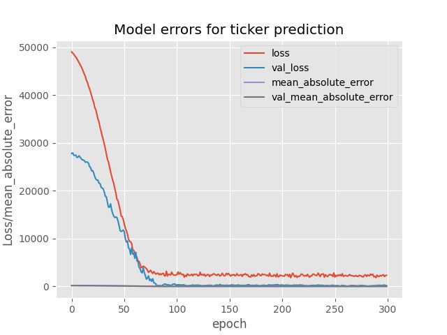
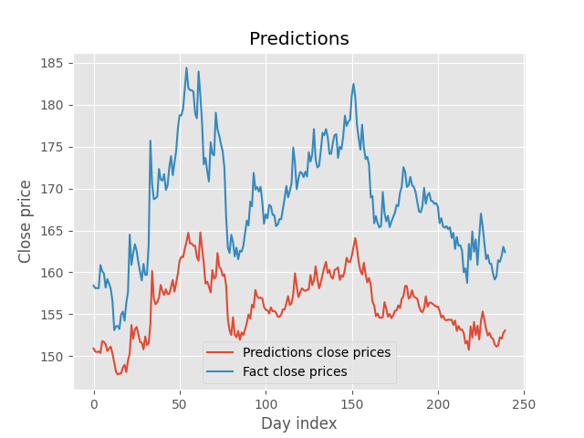

# Neural_network_for_stock_prediction
Neural network for predicting closing prices for shares on the MOEX exchange

# Technologies used
## Python 3.11.7

# Example
### Ticker (GAZP)

    <h4>Model loss</h4>
    

    <h4>Model prediction</h4>
    

# License

MIT license, details here <a href="LICENSE">LICENSE</a>
